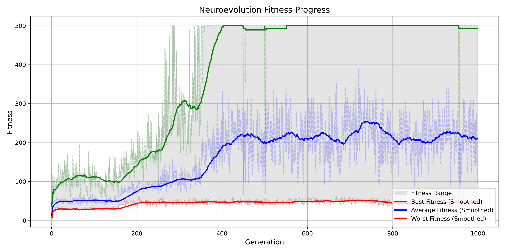
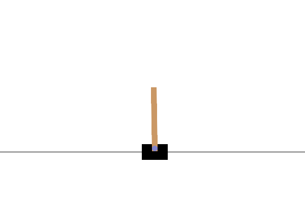

# Neuroevolution CartPole-v1

This project explores how simple genetic algorithms can be used to solve reinforcement learning environments by evolving neural networks, completely bypassing traditional gradient-based methods like backpropagation.

The task tackled here is the classic [CartPole-v1](https://gymnasium.farama.org/environments/classic_control/cart_pole/) environment from OpenAI Gym. The objective is straightforward: balance a pole on a moving cart for as long as possible. Instead of relying on gradient descent to optimize a neural network, this implementation evolves a population of neural networks by evaluating their fitness through direct interaction with the environment.

At its core, each neural network’s weights are represented as a flat genome — a simple array of numbers. These genomes undergo mutation through Gaussian noise, crossover between parents, and are selected based on their performance in the environment. The only feedback they receive is their fitness score: how long they manage to keep the pole upright.

Over the course of a few generations, the population rapidly improves. CartPole is an intentionally simple environment, but this project demonstrates how evolutionary strategies can achieve strong results without gradients, backpropagation, or differentiability.

## How it Works

The architecture used is a small feedforward neural network with a single hidden layer. It receives the environment’s four observations (cart position, cart velocity, pole angle, and pole velocity) and outputs a simple decision: push the cart left or right.

The training loop evaluates each neural network by running a full episode in the CartPole environment. Better-performing networks survive and reproduce through crossover and mutation, while weaker ones are discarded. Over time, this survival-of-the-fittest mechanism leads to more stable and capable controllers.

Below is an example of how performance typically improves over generations:

<p align="center">  </p>

## Results

Despite the simplicity of the approach, the algorithm consistently solves CartPole in fewer than 10 generations. The neural networks discover stable behaviors without any explicit knowledge of physics or control theory — just through random mutation, selection, and persistence.

The best-performing agents can be saved and visualized. Here's an example of a solved CartPole run generated entirely through evolution:

<p align="center">  </p>

## Why this Project

The aim was to explore neuroevolution as an alternative to traditional reinforcement learning. While evolutionary algorithms are rarely used for high-performance RL these days, they remain elegant, intuitive, and robust methods for solving environments where gradients are unavailable, unreliable, or unnecessary.

This project serves as a minimal but complete example of how simple principles of evolution can lead to competent behavior in reinforcement learning environments. It's also a strong starting point for exploring more challenging tasks or more sophisticated evolutionary techniques.

## Dependencies

To run this project, install the dependencies with the following command:

```bash
pip install -r requirements.txt
```


